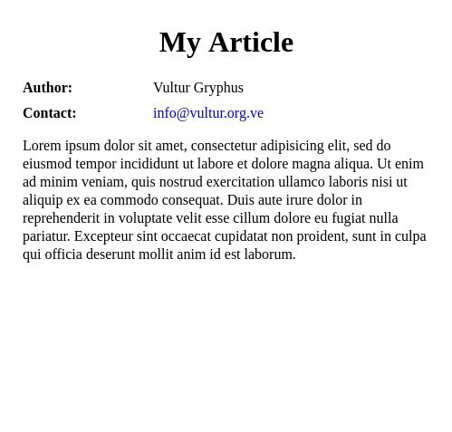

[](https://pypi.python.org/pypi/NtDocutils)

**NtDocutils** is a theme manager for [Docutils](http://docutils.sourceforge.net/).
It acts as a wrapper for the `rst2html5.py` front end.

## Install

**NtDocutils** requires:

* Python 3.4 or above
* Docutils 0.14 (auto installed)
* Pygments 2.2.0 (auto installed)

### From PyPI

```shell-session
# pip install NtDocutils==1.0.0
```

### From source

```shell-session
$ wget -c 'https://github.com/ntrrg/ntdocutils/archive/v1.0.0.tar.gz'
```

```shell-session
$ tar -xvf ntdocutils-1.0.0.tar.gz
```

```shell-session
$ cd ntdocutils-1.0.0
```

```shell-session
# python3 setup.py
```

## Usage

Basically, you have to do two things:

1\. Create a `.rst` file:

`example.rst`:

```rest
==========
My Article
==========

:Author: Vultur Gryphus
:Contact: info@vultur.org.ve

Lorem ipsum dolor sit amet, consectetur adipisicing elit, sed do
eiusmod tempor incididunt ut labore et dolore magna aliqua. Ut enim ad
minim veniam, quis nostrud exercitation ullamco laboris nisi ut aliquip
ex ea commodo consequat. Duis aute irure dolor in reprehenderit in
voluptate velit esse cillum dolore eu fugiat nulla pariatur. Excepteur
sint occaecat cupidatat non proident, sunt in culpa qui officia
deserunt mollit anim id est laborum.
```

2\. Process your file:

```shell-session
$ ntdocutils example.rst example.html
```

And that's it, you already have a HTML file, just like Docutils.



To use a theme, just install it and pass the `-T THEME` flag, for example, to
use the [MDL](https://getmdl.io) theme.

```shell-session
# pip install ntdocutils-theme-mdl
```

```shell-session
$ ntdocutils -T mdl example.rst example.html
```

And this is the result:


## Themes

* [MDL](https://ntrrg.github.io/ntdocutils-theme-mdl)

## Uninstall

Should be enough with this:

```shell-session
# pip uninstall -y NtDocutils docutils Pygments
```

## Contributing

See the [contribution guide](CONTRIBUTING.md) for more information.

## Acknowledgment

Working on this project I use/used:

* [Debian](https://www.debian.org/)

* [XFCE](https://xfce.org/)

* [Sublime Text 3](https://www.sublimetext.com/3)

* [Chrome](https://www.google.com/chrome/browser/desktop/index.html)

* [Terminator](https://gnometerminator.blogspot.com/p/introduction.html)

* [Zsh](http://www.zsh.org/)

* [Git](https://git-scm.com/)

* [EditorConfig](http://editorconfig.org/)

* [Github](https://github.com)

* [Inkscape](https://inkscape.org/en/)

* [GIMP](https://www.gimp.org/)

* [Material Icons](https://material.io/icons/)

* [Roboto](https://fonts.google.com/specimen/Roboto)

* [RawGit](https://rawgit.com/)

* [st](https://st.suckless.org/)

* [GNU Screen](https://www.gnu.org/software/screen)

* [Vim](https://www.vim.org/)

* [Gogs](https://gogs.io/)

**Docutils Team.** *reStructuredText.* <http://docutils.sourceforge.net/rst.html>

**Mozilla Developer Network.** *JavaScript.* <https://developer.mozilla.org/en-US/docs/Web/JavaScript>

