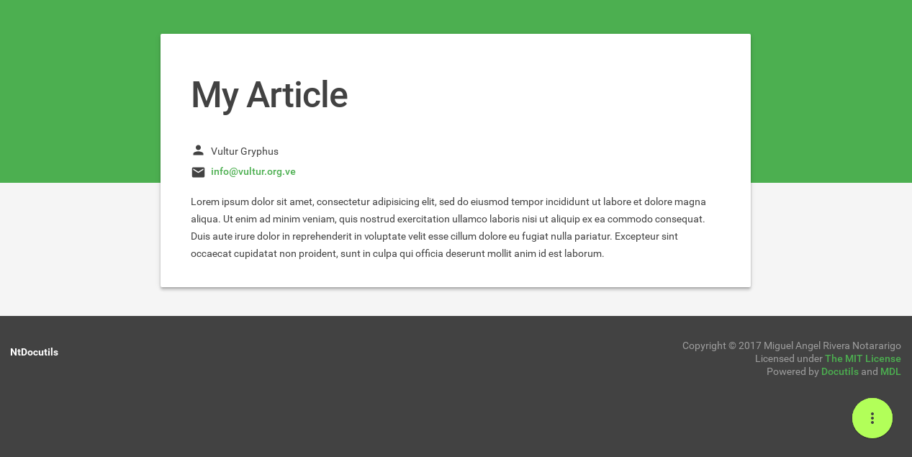

.. raw:: html

    

      
    

.. image:: https://img.shields.io/pypi/v/NtDocutils.svg
    :target: https://pypi.python.org/pypi/NtDocutils

.. image:: https://img.shields.io/badge/license-MIT-blue.svg
    :alt: License
    :target: https://github.com/ntrrg/NtDocutils/blob/v0.2.1/LICENSE

__ https://getmdl.io/

**NtDocutils** is a `Material Design Lite`__ theme for Docutils_. See the
`official site <https://ntrrg.github.io/NtDocutils/>`_ for more info.

Features
========

* All the features from Docutils_ for the ``rst2html5.py`` writer.

* Special roles for emojis and keyboard keys.

* Filter content by OS, distributions, categories or any other filters you
  want.

* Attachments, print friendly and more.

* Theme customization.

Install
=======

**NtDocutils** requires:

* `Python <https://www.python.org/>`_ 3.4 or above
* Docutils_ 0.14 (autoinstalled)
* `Pygments <http://pygments.org/>`_ 2.2.0 (autoinstalled)

From PyPI
---------

.. code:: sh

    pip install NtDocutils==0.2.1

From source
-----------

.. code:: sh

    wget -c 'https://github.com/ntrrg/NtDocutils/archive/v0.2.1.tar.gz'

.. code:: sh

    tar -xvf NtDocutils-0.2.1.tar.gz

.. code:: sh

    cd NtDocutils-0.2.1

.. code:: sh

    python3 setup.py

Usage
=====

Basically, you have to do two things:

#. Create a ``.rst`` file:

   ``example.rst``:

   .. code:: rest
       :number-lines:

       ==========
       My Article
       ==========

       :Author: Vultur Gryphus
       :Contact: info@vultur.org.ve

       Lorem ipsum dolor sit amet, consectetur adipisicing elit, sed do
       eiusmod tempor incididunt ut labore et dolore magna aliqua. Ut enim ad
       minim veniam, quis nostrud exercitation ullamco laboris nisi ut aliquip
       ex ea commodo consequat. Duis aute irure dolor in reprehenderit in
       voluptate velit esse cillum dolore eu fugiat nulla pariatur. Excepteur
       sint occaecat cupidatat non proident, sunt in culpa qui officia
       deserunt mollit anim id est laborum.

#. Process your file:

   .. code:: sh

       ntdocutils example.rst example.html

And that's it, you already have some like this:

__ https://ntrrg.github.io/NtDocutils/#usage

The official site shows a better explanation in `this section`__.

Command line reference
----------------------

All options from the ``rst2html5.py`` writer are available.

.. code:: text

    ntdocutils [-h] [-V] [-S SERVER] SOURCE DESTINATION

-h, --help
    Shows the help message.

-V, --version
    Shows the **NtDocutils** version.

-S SERVER, --server SERVER
    Server from where assets will be downloaded. If ``local`` is passed as
    value, it will activate the offline mode, this will create a directory
    with the theme name in the ``DESTINATION`` parent folder and stores the
    necessary assets in there.

Uninstall
=========

Should be enough with this:

.. code:: sh

    pip uninstall -y NtDocutils docutils Pygments

Contributing
============

See the `contribution guide <CONTRIBUTING.md>`_ for more information.

Acknowledgment
==============

Working on this project I use/used:

* `Debian <https://www.debian.org/>`_

* `XFCE <https://xfce.org/>`_

* `Sublime <ext 3](https://www.sublimetext.com/3>`_

* `Chrome <https://www.google.com/chrome/browser/desktop/index.html>`_

* `Terminator <https://gnometerminator.blogspot.com/p/introduction.html>`_

* `Zsh <http://www.zsh.org/>`_

* `Git <https://git-scm.com/>`_

* `EditorConfig <http://editorconfig.org/>`_

* `Github <https://github.com>`_

* `Inkscape <https://inkscape.org/en/>`_

* `GIMP <https://www.gimp.org/>`_

* `Material Icons <https://material.io/icons/>`_

* `Roboto <https://fonts.google.com/specimen/Roboto>`_

* `RawGit <https://rawgit.com/>`_

**Docutils Team.** *reStructuredText.* http://docutils.sourceforge.net/rst.html

**Mozilla Developer Network.** *JavaScript.* https://developer.mozilla.org/en-US/docs/Web/JavaScript

.. Links

.. _Docutils: http://docutils.sourceforge.net/
