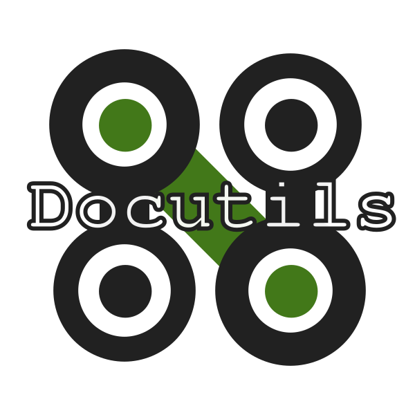
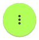
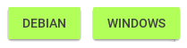
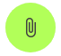

.. role:: emoji
.. role:: kbd

.. role:: css(code)
    :language: css

==========
NtDocutils
==========

-----
0.2.2
-----

:Author: Miguel Angel Rivera Notararigo
:Contact: ntrrgx@gmail.com
:Date: 2018-03-21 03:18:00 -04:00
:License: `MIT <https://github.com/ntrrg/NtDocutils/blob/v0.2.2/LICENSE>`_

__ MDL_

**NtDocutils** is a `Material Design Lite`__ theme for Docutils_ (maybe a
little more :emoji:`😄`). This site was built with it, so you may see what is
possible to do, but if you want to see all the styles, checkout the `demo
site`_.

.. contents::

|pb|

Features
========

__ `Demo site`_

* `All features`__ from Docutils_ for the ``rst2html5.py`` writer.

__ demo.html#emojis-and-keyboard-keys

* Special roles for emojis and keyboard keys (see `this section`__).

__ `Filtering`_

* Filter content by OS, distributions, categories or any other filters you
  want (see `this section`__).

__ Attachments_
__ Translations_

* Attachments (see `this section`__), print, translations linking (see `this
  section`__) and more from the |options-button| button.

__ Printing_
__ Responsiveness_

* Print friendly (see `this section`__) and responsiveness (see `this
  section`__).

__ `Theme customization`_

* Theme customization (see `this section`__).

Install
=======

.. warning::
    :class: fl fl-debian

    Superuser privileges will be needed if you don't use a virtualenv.

**NtDocutils** requires:

* `Python <https://www.python.org/>`_ 3.4 or above
* Docutils_ 0.14 (autoinstalled)
* `Pygments <http://pygments.org/>`_ 2.2.0 (autoinstalled)

From PyPI
---------

.. code:: sh
    :class: fl fl-debian

    pip install NtDocutils==0.2.2

.. code:: bat
    :class: fl fl-windows

    pip install NtDocutils==0.2.2

From source
-----------

.. class:: fl fl-debian

    .. code:: sh

        wget -c 'https://github.com/ntrrg/NtDocutils/archive/v0.2.2.tar.gz'

    .. code:: sh

        tar -xvf NtDocutils-0.2.2.tar.gz

    .. code:: sh

        cd NtDocutils-0.2.2

    .. code:: sh

        python3 setup.py

.. class:: fl fl-windows

    Download an extract the file
    https://github.com/ntrrg/NtDocutils/archive/v0.2.2.tar.gz, then run the
    following commands:

    .. code:: bat

        cd NtDocutils-0.2.2

    .. code:: bat

        python3 setup.py

.. class:: fl fl-windows

|pb|

Usage
=====

Basically, you have to do two things:

#. Create a ``.rst`` file:

   .. class:: fl fl-debian

   ``example.rst``:

   .. include:: example.rst
       :code: rest
       :number-lines:

#. Process your file:

   .. code:: sh
       :class: fl fl-debian

       ntdocutils example.rst example.html

   .. code:: bat
       :class: fl fl-windows

       ntdocutils example.rst example.html

And that's it, you already have some like this:

.. raw:: html

    <object data="example.html" type="text/html" height="400px" width="100%"
        class="media-screen">
    </object>

.. image:: images/example.png
    :class: media-print
    :height: 25em
    :align: center

The following sections cover the usage of some utilities to improve your
article and at the end you can see the `command line reference`_.

Filtering
---------

You can filter content just adding the ``fl fl-{{ filter name }}`` classes in
the elements you want filter, **NtDocutils** will create the buttons
dynamically at the left bottom corner and set the first filter that it finds
as default. E.g:

.. code:: rest
    :number-lines:

    .. class:: fl fl-debian

    **Text for Debian**

    .. class:: fl fl-windows

    **Text for Windows**

Will result in:

.. class:: fl fl-debian

**Text for Debian**

.. class:: fl fl-windows

**Text for Windows**

And creates the following buttons:

Attachments
-----------

You can set a list of useful files in the |attachments-button| button by
adding the following lines in the article:

.. code:: rest
    :number-lines:

    .. raw:: html

        

.. admonition:: Syntax
    :class: syntax

    ``ATTACHMENTS`` is a global array, it store the files list showed in the
    |attachments-button| button, each file must be defined as an object with
    the following properties:

    ``url`` (string)
      URL to the file, could be an external link.

    ``name`` (string)
      **Optional**. Name displayed at the list, also overwrites the attachment
      name.

    __ https://material.io/icons/

    ``icon`` (string)
      **Optional**. `Material icon`__ displayed at the list, by default
      **NtDocutils** uses an icon related to the file extension.

    .. code:: text
        :number-lines:

        .. raw:: html

            

Translations
------------

You can link article translations in the |lang-button| button by adding the
following lines in the article:

.. code:: rest
    :number-lines:

    .. raw:: html

        

.. admonition:: Syntax
    :class: syntax

    ``LANGS`` is a global array, it store the translations list showed in the
    |lang-button| button, each translation must be defined as an object with
    the following properties:

    ``url`` (string)
      URL to the translation page, could be an external link.

    ``name`` (string)
      Name displayed at the list.

    .. code:: text
        :number-lines:

        .. raw:: html

            

Printing
--------

There are some special classes that let you improve the way your article is
printed when something goes wrong; for example, some content doesn't fit at the
page or simply can't be showed as it should in paper. These classes are:

* :css:`.media-screen`: shows the element just in a screen.
* :css:`.media-print`: shows the element just in paper.

**Examples:**

White spaces for paper (useful for ensure printing format):

.. code:: rst
    :number-lines:

    .. Page break

    .. |pb| raw:: html

        

    .. Line break

    .. |lb| raw:: html

         

Display content for specific device:

.. code:: rst

    .. Screen

    .. raw:: html

        <object data="example.html" type="text/html" height="400px"
            width="100%" class="media-screen">
        </object>

    .. Paper

    .. image:: images/example.png
        :class: media-print

Responsiveness
--------------

With responsiveness classes is easy to improve how the article is viewed in
different sized screens, just use ``large-screen`` and ``small-screen`` when
you want it work, try it, resize the window.

.. code:: text
    :class: large-screen

    ##########################
    # LARGE SCREEN DETECTED! #
    ##########################

.. code:: text
    :class: small-screen

    ##########################
    # SMALL SCREEN DETECTED! #
    ##########################

.. code:: rst

    .. code:: text
        :class: large-screen

        ##########################
        # LARGE SCREEN DETECTED! #
        ##########################

    .. code:: text
        :class: small-screen

        ##########################
        # SMALL SCREEN DETECTED! #
        ##########################

Theme customization
-------------------

__ https://getmdl.io/customize/
__ attachments/customize.css

You can use the `customize tool`__ from the MDL_ site to get a custom
``.css`` with your preferred colors, after that, you must setup some styles
by creating a file with the following template__:

``customize.css``

.. code:: css
    :number-lines:

    /* Ribbon */

        .ribbon {
            background-color: {{ Primary color }};
        }

    /* ... */

.. code:: css
    :number-lines: 83

    /* ... */

    /* Links */

        /*a {
            color: {{ Accent color }};
        }*/

    /* ... */

The recommended color for the ribbon background (line 4) is the primary color
from the theme, you can get this value searching the property ``color`` at the
rule ``.mdl-button.mdl-button--colored`` in the file downloaded from MDL_
(``material.min.css``). The links (line 88) use the accent color from the
theme, but in some cases this make them a little unreadable, so you could
uncomment it and use the primary color. You should feel free editing the others
rules, but usually they will be fine with that values. When you are ready, you
have to run **NtDocutils** with the following option:

.. code:: sh
    :class: fl fl-debian

    ntdocutils --stylesheet=path/to/material.min.css,path/to/customize.css \
    source.rst destination.html

.. code:: bat
    :class: fl fl-windows

    ntdocutils --stylesheet=path/to/material.min.css,path/to/customize.css \
    source.rst destination.html

Command line reference
----------------------

.. code:: text

    ntdocutils [-h] [-V] [-S SERVER] SOURCE DESTINATION

-h, --help
    Shows the help message.

-V, --version
    Shows the **NtDocutils** version.

-S SERVER, --server SERVER
    Server from where assets will be downloaded. If ``local`` is passed as
    value, it will activate the offline mode, this will create a directory
    with the theme name in the ``DESTINATION`` parent folder and stores the
    necessary assets in there.

.. note::

    All options from the ``rst2html.py`` writer are available.

Uninstall
=========

.. warning::
    :class: fl fl-debian

    Superuser privileges will be needed if you didn't use a virtualenv.

Should be enough with this:

.. code:: sh
    :class: fl fl-debian

    pip uninstall NtDocutils

.. code:: bat
    :class: fl fl-windows

    pip uninstall NtDocutils

Contributing
============

__ https://github.com/ntrrg/NtDocutils/blob/v0.2.2/CONTRIBUTING.md

See the `contribution guide`__ for more information.

|pb|

Acknowledgment
==============

Working on this project I use/used:

* `Debian <https://www.debian.org/>`_

* `XFCE <https://xfce.org/>`_

* `Sublime <ext 3](https://www.sublimetext.com/3>`_

* `Chrome <https://www.google.com/chrome/browser/desktop/index.html>`_

* `Terminator <https://gnometerminator.blogspot.com/p/introduction.html>`_

* `Zsh <http://www.zsh.org/>`_

* `Git <https://git-scm.com/>`_

* `EditorConfig <http://editorconfig.org/>`_

* `Github <https://github.com>`_

* `Inkscape <https://inkscape.org/en/>`_

* `GIMP <https://www.gimp.org/>`_

* `Material Icons <https://material.io/icons/>`_

* `Roboto <https://fonts.google.com/specimen/Roboto>`_

* `RawGit <https://rawgit.com/>`_

**Docutils Team.** *reStructuredText.* http://docutils.sourceforge.net/rst.html

**Mozilla Developer Network.** *JavaScript.* https://developer.mozilla.org/en-US/docs/Web/JavaScript

.. _MDL: https://getmdl.io/
.. _Docutils: http://docutils.sourceforge.net/
.. _Demo site: https://ntrrg.github.io/NtDocutils/demo.html

.. raw:: html

    

.. |pb| raw:: html

    

